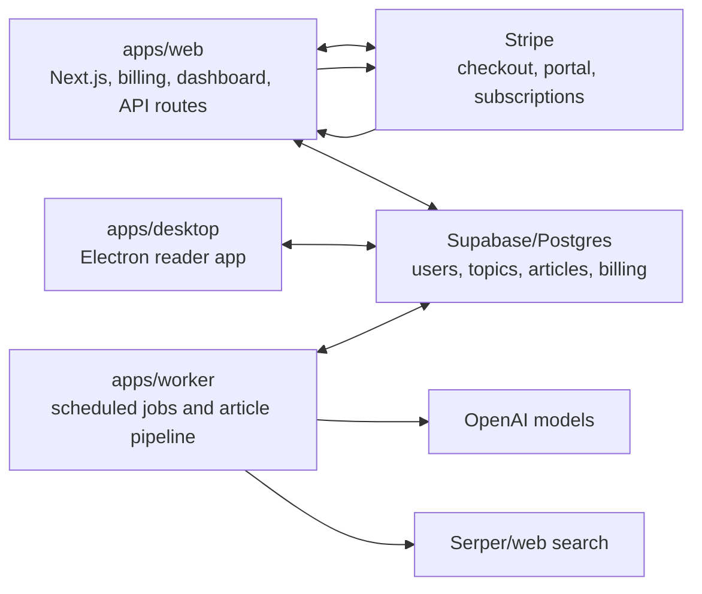
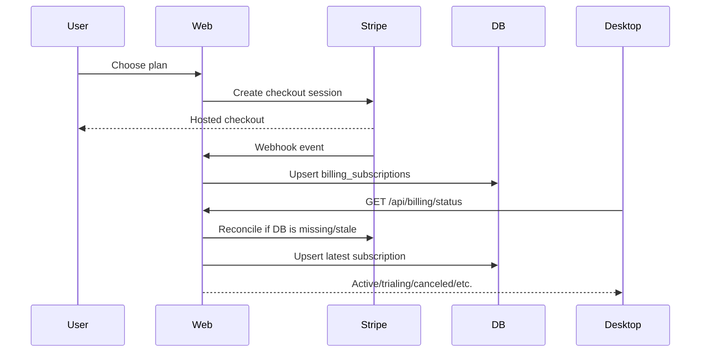
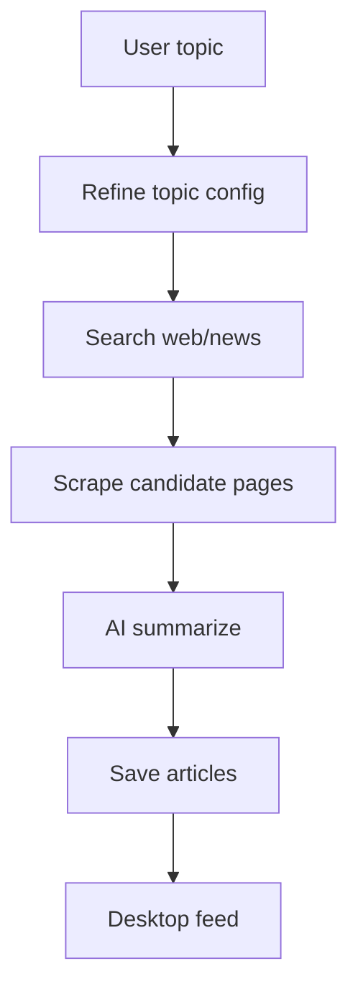
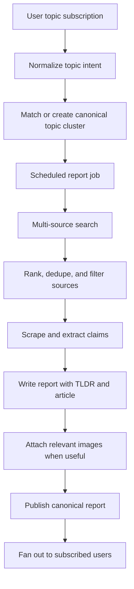

# Architecture

This document explains what each part of the monorepo owns and how the major Orca flows work today. It also marks where the system needs to evolve for the roadmap.

## Product Intent

Orca should be the best personalized news app for individual needs. A user can subscribe to any topic, from broad to highly specific, and receive a report on a chosen cadence. The report should combine the best available sources from the web into a polished article with:

- A 30-second TLDR at the top.
- A concise but real article after the TLDR.
- Multiple-source synthesis instead of single-source rewriting.
- Clear source attribution.
- Relevant dynamic images when they add understanding.
- Daily, weekly, and eventually real-time delivery modes.

## High-Level System

## Apps

### `apps/web`

The web app is a Next.js App Router application. It owns the public and account web experience:

- Landing, pricing, product, mission, blog, contact, privacy, terms.
- Subscribe page and auth-adjacent subscription flow.
- Dashboard page for account and billing state.
- Stripe checkout, Stripe portal, webhook handling, and billing status reconciliation.
- Account deletion API.
- Topic refinement API endpoint.

Important paths:

- `apps/web/app/dashboard/page.tsx`: reads current plan/status for the dashboard.
- `apps/web/components/Auth/SubscribeAuth.tsx`: checks whether a signed-in user already has access before starting checkout.
- `apps/web/app/api/billing/status/route.ts`: server route that verifies the Supabase session and reconciles billing state from Stripe.
- `apps/web/app/api/stripe/checkout/route.ts`: creates Stripe Checkout sessions.
- `apps/web/app/api/stripe/webhook/route.ts`: persists Stripe subscription events into Supabase.
- `apps/web/lib/stripeBilling.ts`: shared Stripe-to-Supabase normalization helpers.

Payment rule: treat Stripe as the payment source of truth and `billing_subscriptions` as the local DB cache. Avoid building new access checks from `users.subscription_status`.

### `apps/desktop`

The desktop app is an Electron + React + Vite application. It is the main reader/product surface. Users sign in, pass subscription gating, manage topics, and read generated articles.

Important paths:

- `apps/desktop/src/main.ts`: Electron main process entry.
- `apps/desktop/src/preload.ts`: safe bridge from main process to renderer.
- `apps/desktop/src/window.ts`: BrowserWindow setup.
- `apps/desktop/src/renderer/App.tsx`: top-level renderer, auth, subscription gate, layout, and main view switching.
- `apps/desktop/src/renderer/components/onboarding/OnboardingFlow.tsx`: topic creation/onboarding flow.
- `apps/desktop/src/renderer/stores/feedStore.ts`: topic/article state and realtime behavior.
- `apps/desktop/src/renderer/lib/supabase.ts`: desktop Supabase client and session refresh.

Current subscription behavior:

1. User signs in.
2. Desktop gets a Supabase session.
3. Desktop calls the web API billing status endpoint when possible.
4. If the API cannot be reached, desktop falls back to direct `billing_subscriptions` read.
5. Active/trialing users enter the app; others see the Plan inactive component.

### `apps/worker`

The worker is the content engine. It owns scheduled/background work for topic fetching, web search, scraping, AI summarization, and article writes.

Important paths:

- `apps/worker/src/index.ts`: process entry and worker server setup.
- `apps/worker/src/scheduler.ts`: scheduled polling.
- `apps/worker/src/queue.ts`: queue wiring.
- `apps/worker/src/jobs/fetchNews.ts`: fetch job entry.
- `apps/worker/src/jobs/summarize.ts`: summarization job entry.
- `apps/worker/src/services/pipeline.ts`: main fetch/search/scrape/summarize pipeline.
- `apps/worker/src/services/serperSearch.ts`: web/news search provider.
- `apps/worker/src/services/scraper.ts`: article extraction.
- `apps/worker/src/services/topicRefinement.ts`: turns rough user intent into useful topic config.
- `apps/worker/src/ai`: worker-local AI helpers and prompts.

Current worker model:

1. Find active topics due for fetching.
2. Search the web for candidate URLs.
3. Scrape article bodies.
4. Summarize into article records.
5. Upsert articles into Supabase.

Future worker model should move from "article per source summary" toward "multi-source report synthesis" with dedupe, source ranking, and shared report reuse.

## Packages

### `packages/db`

Shared database package. It contains:

- SQL schema files in `packages/db/sql`.
- TypeScript database types in `packages/db/src/types.ts`.
- Zod schemas in `packages/db/src/schemas.ts`.
- Supabase client factories in `packages/db/src/client.ts`.
- Shared DB queries in `packages/db/src/queries.ts`.

When changing DB shape, update all of these when relevant:

- SQL schema or migration.
- `types.ts`.
- `schemas.ts`.
- Query helpers.
- Any direct Supabase `.select(...)` strings in apps.

### `packages/ai`

Shared AI package for cross-app AI functions. It contains model selection and summarization/topic-agent utilities used by the worker and web routes.

Important paths:

- `packages/ai/src/models.ts`: model configuration.
- `packages/ai/src/summarizer.ts`: summary generation.
- `packages/ai/src/topicAgent.ts`: topic refinement logic.

Use this package for reusable AI behavior. Keep app-specific orchestration in the app that owns the workflow.

### `packages/config`

Shared config package. It contains environment resolvers, constants, and category data.

Important paths:

- `packages/config/src/env.ts`: environment variable resolution.
- `packages/config/src/constants.ts`: shared constants.
- `packages/config/src/categories.ts`: topic/category values.

If an env var is needed by more than one app/package, prefer putting the resolver logic here.

## Database Areas

Core tables from `packages/db/sql/0001_newsflow_schema.sql`:

- `users`: public profile row tied to `auth.users`.
- `topics`: user-owned topic subscriptions.
- `articles`: generated article/report records tied to topics.
- `article_reads`: read/listen tracking.
- `billing_subscriptions`: Stripe-backed subscription state.
- `checkout_sessions`: Stripe checkout tracking.
- `billing_events`: webhook event logging target.

Current limitations:

- Topics are user-owned, so identical/similar topics across users are not yet deduped.
- Articles are tied directly to topic IDs, so shared report reuse needs a new canonical topic/report layer.
- Billing event persistence exists in schema but webhook processing currently focuses on updating subscription rows.

## Billing Flow

Local development gotcha: if Stripe CLI is not forwarding webhooks to the local web app, successful local checkout will not update Supabase through the webhook. The billing status route can self-heal by reading Stripe directly, but it still needs `STRIPE_SECRET_KEY`, `SUPABASE_SERVICE_ROLE_KEY`, and network access from the web server.

## Content Generation Flow

Current flow:

Target flow:

The big architectural shift is from user-owned topic generation to canonical topic/report generation plus user-specific delivery. That is how Orca becomes cost-efficient when many users subscribe to "AI" or similar topics.

## Dynamic Images

Images should be treated as report evidence or comprehension aids, not decoration. Future image handling should decide:

- Whether this report needs images at all.
- How many images are useful.
- Whether images should come from source pages, licensed APIs, generated assets, or charts built from extracted data.
- Where images appear in the report.
- How to store attribution, alt text, source URL, and safety/relevance metadata.

A good starting model:

- Use source-page images only when they are clearly tied to the story and attribution is available.
- Use generated diagrams/charts for explainers, timelines, maps, and comparisons.
- Prefer zero images for short or purely analytical reports unless an image improves comprehension.

## Scheduling

Today, scheduling is worker-owned through cron/BullMQ style behavior. The roadmap calls out cron jobs and Trigger.dev as possible future orchestration.

Recommended direction:

- Keep job payloads idempotent.
- Make report generation addressable by canonical topic ID plus date/cadence.
- Store job runs and output hashes so retries do not duplicate reports.
- Use Trigger.dev or equivalent when job visibility, retries, backfills, and production operations become painful.

## Cost-Efficient Shared Topics

The important future abstraction is a canonical topic cluster:

- User topic: exactly what one user subscribed to.
- Canonical topic: normalized version that many users can share.
- Canonical report: one generated report for a canonical topic/cadence/date.
- Delivery mapping: each user gets the canonical report if their subscription matches it.

Example:

- User A subscribes to "AI".
- User B subscribes to "latest artificial intelligence news".
- User C subscribes to "AI breakthroughs this week".

These may map to the same canonical topic for a daily general AI report. Orca should generate once, then deliver to all matching users. Hyperspecific topics should still get their own reports when they are meaningfully different.

