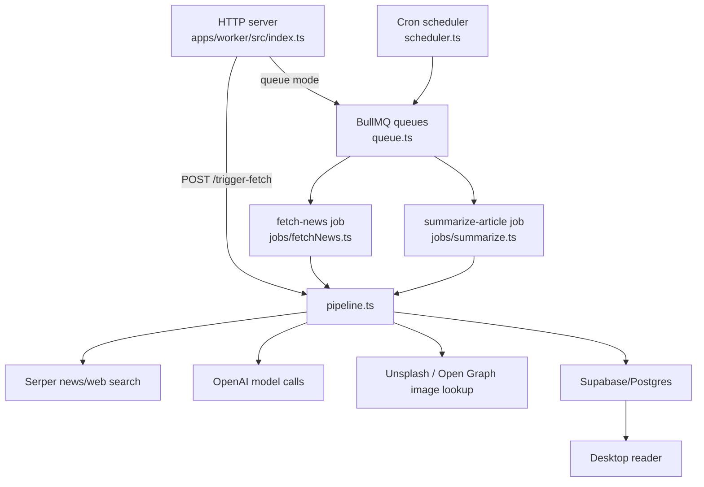

# Worker Architecture And Operations

This document is the worker handoff for future agents. Read it before changing scheduled jobs, queues, Redis, article generation, or anything that can create API cost.

The worker lives in `apps/worker`. It is the content engine for Orca: it turns user topics into generated article records that the desktop app reads from Supabase.

## Goal

The product goal is not just "fetch news." Orca should generate useful personalized reports for user-defined topics. The worker should eventually:

- Normalize user topics into reusable canonical topic/report work.
- Search multiple high-quality sources.
- Dedupe and rank those sources.
- Extract facts, quotes, metrics, timelines, and relevant context.
- Write a polished report with a short TLDR and concise article body.
- Attach images only when they improve comprehension and can be attributed.
- Publish once, then fan out to subscribed users where possible.

The current worker is an early version of that system. It still mostly creates article records per discovered source, with newer MDX/distillation steps layered on top.

## Current Runtime Shape



## Main Files

- `apps/worker/src/index.ts`: process entrypoint, HTTP server, queue/scheduler startup, shutdown.
- `apps/worker/src/lib/env.ts`: worker env parsing and defaults.
- `apps/worker/src/scheduler.ts`: cron polling for due topics.
- `apps/worker/src/queue.ts`: BullMQ queues, workers, job options, Redis connections.
- `apps/worker/src/jobs/fetchNews.ts`: small wrapper around the fetch pipeline.
- `apps/worker/src/jobs/summarize.ts`: small wrapper around the summarize pipeline.
- `apps/worker/src/services/pipeline.ts`: core orchestration for search, summarization, MDX, images, article upsert, memory indexing, and digest email.
- `apps/worker/src/services/serperSearch.ts`: search provider integration.
- `apps/worker/src/services/scraper.ts`: source extraction.
- `apps/worker/src/services/articleAssets.ts`: Unsplash first, Open Graph fallback.
- `apps/worker/src/services/articleMemory.ts`: article chunking, embeddings, rolling topic memory.
- `apps/worker/src/services/email.ts`: digest email sending.
- `apps/worker/src/ai`: worker-local model calls and prompts.

## Modes

The worker can run in two broad modes.

### Safe Local Inline Mode

Use this for normal local development and debugging:

```bash
WORKER_SCHEDULER_ENABLED=false
WORKER_QUEUE_ENABLED=false
WORKER_MANUAL_TRIGGER_MODE=inline
WORKER_JOB_ATTEMPTS=1
WORKER_MAX_ARTICLES_PER_FETCH=1
WORKER_DIGEST_EMAIL_ENABLED=false
WORKER_MDX_FALLBACK_ENABLED=false
ENABLE_ARTICLE_MDX_PIPELINE=true
```

In this mode `POST /trigger-fetch` runs the pipeline inline and does not use BullMQ/Redis. This is the safest way to test one topic without idle Redis command burn or queue retries.

### Queue / Scheduled Mode

Use this only when intentionally testing production-like background behavior:

```bash
WORKER_QUEUE_ENABLED=true
WORKER_MANUAL_TRIGGER_MODE=queue
WORKER_SCHEDULER_ENABLED=true
WORKER_JOB_ATTEMPTS=1
WORKER_MAX_ARTICLES_PER_FETCH=1
WORKER_AUDIO_QUEUE_ENABLED=false
```

Queue mode uses Upstash Redis through BullMQ. Even with no user-visible jobs, BullMQ workers use Redis for blocking reads, stalled-job checks, locks, retries, cleanup, and queue metadata. Do not assume "no topics created" means "no Redis commands."

## Important Env Vars

- `SUPABASE_URL`: Supabase project URL.
- `SUPABASE_SERVICE_ROLE_KEY`: service role key for worker writes. Never expose this to browser/renderer code.
- `OPENAI_API_KEY`: model calls for distillation, MDX, summaries, embeddings.
- `SERPER_API_KEY`: news/web search.
- `UNSPLASH_ACCESS_KEY`: optional image search. If absent, image lookup falls back to Open Graph only.
- `UPSTASH_REDIS_URL` or `REDIS_URL`: BullMQ Redis connection string. Required only for queue mode and queue maintenance commands.
- `UPSTASH_REDIS_REST_URL`, `UPSTASH_REDIS_REST_TOKEN`: used by health checks / Upstash REST integration.
- `WORKER_SCHEDULER_ENABLED`: starts cron due-topic discovery.
- `WORKER_QUEUE_ENABLED`: starts BullMQ workers and enables queue enqueue mode.
- `WORKER_AUDIO_QUEUE_ENABLED`: starts the audio worker. Defaults off because current code has no active audio job producer.
- `WORKER_MANUAL_TRIGGER_MODE`: `inline` or `queue`.
- `WORKER_POLL_CRON`: cron expression, default `*/15 * * * *`.
- `WORKER_JOB_ATTEMPTS`: BullMQ attempts, default 1.
- `WORKER_MAX_ARTICLES_PER_FETCH`: max candidate articles per topic fetch, default 1.
- `WORKER_DIGEST_EMAIL_ENABLED`: sends daily/weekly digest email after fetch.
- `WORKER_MDX_FALLBACK_ENABLED`: permits legacy summary fallback after MDX failure.
- `ENABLE_ARTICLE_MDX_PIPELINE`: enables the newer distillation/MDX/article asset path.
- `ARTICLE_DISTILLATION_MODEL`, `ARTICLE_MDX_MODEL`, `ARTICLE_EMBEDDING_MODEL`: model choices.
- `WORKER_AUTH_TOKEN`: optional bearer token for `POST /trigger-fetch`.
- `PORT`: HTTP port, default `3001`.

## Data Flow Today

### Manual Inline Fetch

1. Desktop creates a topic in Supabase.
2. Desktop calls `POST /trigger-fetch` on the worker URL.
3. `index.ts` validates the payload and auth token if configured.
4. If `WORKER_MANUAL_TRIGGER_MODE=inline`, it calls `executeFetchPipeline(..., { inlineSummarize: true })`.
5. The fetch pipeline loads the topic, searches for candidates, and runs each summarize pipeline inline.
6. The summarize pipeline writes or updates rows in `articles`.
7. Desktop realtime/feed refresh sees the new article.

### Scheduled Queue Fetch

1. `scheduler.ts` runs on `WORKER_POLL_CRON`.
2. It loads active topics and filters due topics through `listDueTopics`.
3. It bulk-enqueues `fetch-news` jobs with deterministic job IDs.
4. The pipeline worker processes each fetch job.
5. Scheduled fetches update `last_fetched_at` at the start of the run, so slow or failing runs do not stay immediately due and get re-enqueued on the next tick.
6. The fetch pipeline enqueues or runs summarize jobs.
7. Summarize jobs upsert article records.

### Summarize / MDX Path

When `ENABLE_ARTICLE_MDX_PIPELINE=true`, `executeSummarizePipeline` does:

1. Load the topic and previous topic summary.
2. Distill the source into facts/quotes/metrics/timeline/entities.
3. Generate MDX content and TLDR.
4. Acquire an image asset from Unsplash when `imageSearchQuery` exists, otherwise fall back to Open Graph.
5. Upsert the article.
6. Index article memory and embeddings when topic/user data is available.

If MDX fails and `WORKER_MDX_FALLBACK_ENABLED=false`, the job returns an `mdx_failed` result instead of writing a legacy summary. If fallback is enabled, it generates the older plain summary and writes that.

## Redis / BullMQ Notes

Redis usage comes from BullMQ, not from Unsplash.

Recent incident: an Upstash Redis command dashboard climbed from roughly 10K commands to 25K commands while the user did not intentionally create new jobs or topics. The likely causes in the previous code were:

- Pipeline worker and unused audio worker were always started in queue mode.
- BullMQ's default empty-queue long poll was 5 seconds, so idle workers touched Redis often.
- BullMQ stalled-job checks ran every 30 seconds.
- Scheduler enqueued due topics with one fresh Redis connection and queue per topic.
- Fetch and summarize jobs had no deterministic `jobId`, so repeated ticks or triggers could duplicate work.
- Scheduled topics were marked fetched only after the search/enqueue path completed, so a slow or failing run could remain due and be re-enqueued.

Mitigations now in code:

- `WORKER_AUDIO_QUEUE_ENABLED` defaults off.
- Workers use a longer `drainDelay` and slower `stalledInterval`.
- Scheduler uses `queue.addBulk` with one Redis connection.
- Fetch, summarize, and audio jobs have deterministic `jobId` values.
- Scheduled fetch jobs mark the topic fetched at job start.
- Fetch jobs remove completed/failed records immediately.

Future agents should still inspect actual Upstash command metrics after deploy. BullMQ will never be zero-command while workers are running.

## Current Problems And Investigation Backlog

### Redis Cost / Idle Command Burn

Status: mitigated but not proven in production.

What to check next:

- Compare Upstash command rate before and after deploying the queue patch.
- Confirm only one worker process is running in production.
- Confirm `WORKER_AUDIO_QUEUE_ENABLED=false` unless audio jobs are intentionally produced.
- Confirm `WORKER_SCHEDULER_ENABLED=false` for environments that should not schedule jobs.
- Consider replacing BullMQ for low-volume scheduled work if Upstash command cost remains high.
- Consider Trigger.dev, Railway cron, or direct scheduled HTTP jobs for better observability.

Useful files:

- `apps/worker/src/queue.ts`
- `apps/worker/src/scheduler.ts`
- `apps/worker/src/index.ts`

### Duplicate Or Repeated Topic Fetches

Status: partially mitigated with deterministic job IDs and early scheduled timestamp updates.

Risk:

- Manual triggers can still intentionally re-run a topic.
- Similar topics across users are still separate rows and will each generate work.
- A failed scheduled job now advances `last_fetched_at`, which protects cost but can delay content. That tradeoff is currently intentional after the Redis incident.

Future direction:

- Add explicit job run records with status, timestamps, error, and cost metadata.
- Decide whether failed scheduled fetches should retry through a bounded retry-after field instead of `last_fetched_at`.
- Build canonical topic/report generation so one report can satisfy many users.

### Unsplash / Image Costs And Relevance

Status: basic implementation.

Current behavior:

- If MDX returns `imageSearchQuery`, the worker calls Unsplash search for one landscape photo.
- If Unsplash fails or no key exists, it fetches the source URL and tries Open Graph image metadata.
- Images are stored on the article as `image_url` and `image_attribution`.

Problems:

- Unsplash calls happen per summarized article and are not cached by query or source.
- Search queries may be too generic.
- Images are decorative unless the prompt produces a genuinely useful visual intent.

Future direction:

- Cache image lookup results by normalized query and/or source URL.
- Add an env kill switch for Unsplash specifically if needed.
- Store richer image metadata: source, alt text, relevance reason, license/attribution.
- Prefer source images or generated charts when they explain the report better.

### Pipeline Cost Visibility

Status: weak.

The worker logs major events, but it does not persist a structured job/run ledger. Future agents should add a table for:

- job type
- topic ID
- canonical topic/report ID when available
- trigger source
- model names
- input/output token counts if available
- article count
- external API calls
- status/error
- started/completed timestamps

Without this, cost incidents require reading provider dashboards and logs after the fact.

### Multi-Source Reports

Status: product target, not current implementation.

The current pipeline discovers multiple candidate sources but writes article records per source. The target Orca experience needs one synthesized report per topic/cadence, with sources supporting a single narrative.

Future architecture likely needs:

- canonical topic clusters
- report run table
- source candidate table
- source ranking/dedupe
- claim extraction
- synthesized report table
- user delivery/fanout table

## Operational Playbooks

### Stop Redis Command Growth Fast

If Redis commands are climbing unexpectedly:

1. Set these env vars and redeploy:

```bash
WORKER_QUEUE_ENABLED=false
WORKER_SCHEDULER_ENABLED=false
WORKER_MANUAL_TRIGGER_MODE=inline
WORKER_AUDIO_QUEUE_ENABLED=false
```

2. Confirm worker logs say:

```text
Worker scheduler disabled
Worker queue disabled
```

3. If queue mode was active, clear stuck queues only after confirming it is safe:

```bash
npm run cli -w apps/worker -- clear-queues --yes
```

4. Watch Upstash command rate for at least 10-15 minutes.

### Run One Safe Manual Article Test

1. Use safe local inline mode.
2. Set `WORKER_MAX_ARTICLES_PER_FETCH=1`.
3. Start the worker from repo root with env loaded.
4. Trigger one topic through desktop or curl.
5. Watch for:

```text
Manual fetch trigger received ... mode:inline
News search starting ... maxArticles:1
Fetch pipeline completed
```

### Verify A Worker Change

Build first:

```bash
npm run build -w @newsflow/worker
```

For behavior changes, a build is not enough. Run the worker and trigger a known topic in inline mode. Use queue mode only when the change specifically touches BullMQ scheduling or job behavior.

## Design Rules For Future Agents

- Default to inline mode for local tests.
- Do not enable the scheduler casually.
- Do not enable queue mode unless the task requires BullMQ behavior.
- Keep job payloads idempotent.
- Prefer deterministic job IDs for anything that can be enqueued more than once.
- Add cost controls before increasing articles per fetch, model size, retries, or cadence.
- Treat service role keys as server/worker-only.
- Update SQL, TS types, Zod schemas, and shared queries together for DB shape changes.
- Preserve source attribution when changing article generation.
- Add structured observability before adding more background automation.

